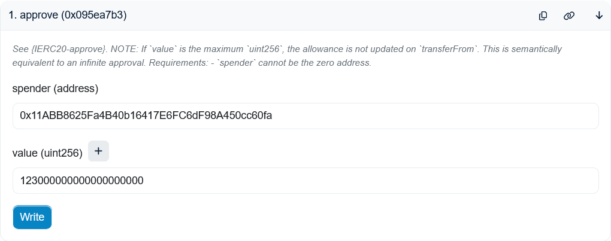
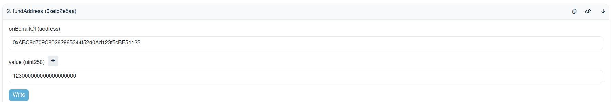

# Hello World Tutorial

In this tutorial, we will be creating a table on the Space and Time chain using an ECDSA wallet.
The major steps we will walk through are

1. Funding a wallet with compute credits.
2. Creating a table on the Space and Time chain.
3. Inserting data into the new table.

## Step 1: Funding a wallet

In order to interact with the Space and Time chain, we need compute credits. In this tutorial, we will use the wallet address `0xABC8d709C80262965344f5240Ad123f5cBE51123` and will be funding our wallet with 123 SXT.

First, we must approve the spend. We call the [`approve`](https://sepolia.etherscan.io/address/0xC768a8F94dcb61a200C9d9B2adbe50B41A80B839#writeContract#F1) function on the SXT contract.

- `spender` is the SXTChainMessaging contract: `0xc2159191D147A8BBD937b0BAbbFF2e47889841AC`.
- `value` is the amount we wish to spend. The SXT token has 18 decimals, so 123 SXT must be entered as `123000000000000000000`.

We are using Etherscan, so we do the following:



Next, we need to actually fund the wallet. We call the [`fundedMessage`](https://sepolia.etherscan.io/address/0xc2159191D147A8BBD937b0BAbbFF2e47889841AC#writeContract#F1) function on the SXTChainMessaging contract.

- `body` is the the hex address that we are funding. Importantly, this is required to be 32 bytes. Since our wallet address is only 20 bytes, we must prepend with 24 additional 0s. This means the address should be `0x000000000000000000000000ABC8d709C80262965344f5240Ad123f5cBE51123`.
- `target` is the SXT Chain address, which is `0xA2B1A10fe54258b5590DB1292173304fc2772eE3`.
- `amount` is what we entered for `value` above. On our case, `123000000000000000000`.

As before, on Etherscan, we get:



## Step 2: Clone this repo

We will be using this repo, which has the scripts that we will be using. So, we clone this repo:

```bash
git clone git@github.com:spaceandtimefdn/sxt-chain-examples.git
cd sxt-chain-examples
```

We will be using [Node.js](https://nodejs.org/en/download/current) which can be installed a variety of ways.

Then, we need to install the prerequisite npm packages:

```bash
npm install
```

Then, we can make the `hello_world_tutorial` directory our working directory.

```bash
cd hello_world_tutorial
```

## Step 3: Creating a table (DDL)

We will write a node script that will create a table for us. This script is named `hello_world_create_table.js`.

We add our private key as an environment variable. We add it to a `.env` file and `import 'dotenv/config';`. The `.env` file looks like this:

```
PRIVATE_KEY=d157███████████████████████ REDACTED ███████████████████████f415
```

The `hello_world_create_table.js` script that will create the following table named `HELLO_WORLD`:

| `ID` (`BINARY`) | `NAME` (`VARCHAR`) | `LATITUDE` (`BIGINT`) | `LONGITUDE` (`BIGINT`) | `AREA` (`BIGINT`) |
| --------------- | ------------------ | --------------------- | ---------------------- | ----------------- |
| 1               | Amazon rainforest  | -3                    | 60                     | 5500000           |
| 2               | Caspian Sea        | 42                    | 51                     | 371000            |
| 3               | Pacific Ocean      | 0                     | 160                    | 165250000         |
| 4               | Antarctic Desert   | -90                   | 0                      | 14200000          |
| 5               | Great Barrier Reef | -16                   | 146                    | 344400            |

First, we create a connection with a Space and Time RPC node:

```javascript
const provider = new WsProvider("wss://rpc.testnet.sxt.network");
const api = await ApiPromise.create({ provider, noInitWarn: true });
```

Next, we build a transaction to create a new namespace. The namespace must end with the wallet address. We will use the namespace `TUTORIAL_ABC8D709C80262965344F5240AD123F5CBE51123`.

```javascript
const createNamespaceTX = api.tx.tables.createNamespace(
  "TUTORIAL_ABC8D709C80262965344F5240AD123F5CBE51123",
  0,
  "CREATE SCHEMA IF NOT EXISTS TUTORIAL_ABC8D709C80262965344F5240AD123F5CBE51123",
  "Community",
  { UserCreated: "Tutorial" },
);
```

Then, we build a transaction for the DDL of the new table.

```javascript
const createTablesTX = api.tx.tables.createTables([
  {
    ident: {
      namespace: "TUTORIAL_ABC8D709C80262965344F5240AD123F5CBE51123",
      name: "HELLO_WORLD",
    },
    createStatement:
      "CREATE TABLE TUTORIAL_ABC8D709C80262965344F5240AD123F5CBE51123.HELLO_WORLD (ID BINARY NOT NULL, NAME VARCHAR NOT NULL, LATITUDE BIGINT NOT NULL, LONGITUDE BIGINT NOT NULL, AREA BIGINT NOT NULL)",
    tableType: "Community",
    commitment: { Empty: { hyperKzg: true } },
    source: { UserCreated: "Planet Earth" },
  },
]);
```

Then, instead of submitting two separate transactions, we opt to batch these into a single transaction

```javascript
const batchTX = api.tx.utility.batchAll([createNamespaceTX, createTablesTX]);
```

Finally, we sign and submit the transaction to the Space and Time chain to create the transaction.

```javascript
const wallet = new Wallet(process.env.PRIVATE_KEY);
await signAndSendEthEcdsa(api, batchTX, wallet);
```

We run the script with

```bash
node hello_world_create_table.js
```

## Step 4: Inserting Data (DML)

Now that we have created the table, we need to insert data. The corresponding script is named `hello_world_insert_data.js`.
The majority of the script is identical to the one that created the table. The only different is how we build the transaction.

The data is inserted to the chain as an Apache Arrow table. We build the table as follows:

```javascript
const table = new Table({
  ID: vectorFromArray(
    [BigInt(1), BigInt(2), BigInt(3), BigInt(4), BigInt(5)],
    new Int64(),
  ),
  NAME: vectorFromArray(
    [
      "Amazon rainforest",
      "Caspian Sea",
      "Pacific Ocean",
      "Antarctic Desert",
      "Great Barrier Reef",
    ],
    new Utf8(),
  ),
  LATITUDE: vectorFromArray([-3n, 42n, 0n, -90n, -16n], new Int64()),
  LONGITUDE: vectorFromArray([60n, 51n, 160n, 0n, 146n], new Int64()),
  AREA: vectorFromArray(
    [5500000n, 371000n, 165250000n, 14200000n, 344400n],
    new Int64(),
  ),
});
```

Finally, we build the transaction that will insert the table. We need to specify a unique `batchId` for each insertion.

```javascript
const batchId = 1;
const insertDataTx = api.tx.indexing.submitData(
  {
    namespace: "TUTORIAL_ABC8D709C80262965344F5240AD123F5CBE51123",
    name: "HELLO_WORLD",
  },
  batchId,
  u8aToHex(tableToIPC(table)),
);
```

We run the script with

```bash
node hello_world_insert_data.js
```

We have now created a table, and inserted data!
