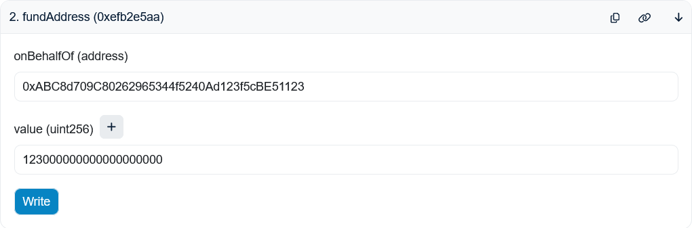

# How to Fund an Account Directly

In order to use the SXT Chain, compute credits are required. This how-to walks through the steps to fund an account with compute credits using the SXTChainFunding smart contract (`0xb1bc1d7eb1e6c65d0de909d8b4f27561ef568199`). Alternatively, see ["How To Fund an Account with Dreamspace Pay"](./HOW_TO_FUND_AN_ACCOUNT_WITH_DSPAY.md).

## Step 1: Approve Spend

Call the [`approve`](https://etherscan.io/address/0xE6Bfd33F52d82Ccb5b37E16D3dD81f9FFDAbB195#writeContract#F1) function on the `SXT` contract.

- `spender` should be the SXTChainFunding contract address: `0xb1bc1d7eb1e6c65d0de909d8b4f27561ef568199`
- `value` should the the amount to be spent. Because SXT has 18 decimals, 123 SXT should be entered as `123000000000000000000`.

## Step 2: Send Funds

Call the [`fundAddress`](https://etherscan.io/address/0xb1bc1d7eb1e6c65d0de909d8b4f27561ef568199#writeContract#F2) function on the SXTChainFunding contract.

- `onBehalfOf` should be the the hex address to be funded: `0xABC8d709C80262965344f5240Ad123f5cBE51123`.
- `value` should be what was entered for `value` above.

> NOTE: To fund a 32-byte address, call [`fund32ByteAddress`](https://etherscan.io/address/0xb1bc1d7eb1e6c65d0de909d8b4f27561ef568199#writeContract#F1) instead. See the ["How To convert between address formats"](./HOW_TO_CONVERT_BETWEEN_ADDRESS_FORMATS.md) for more details.
