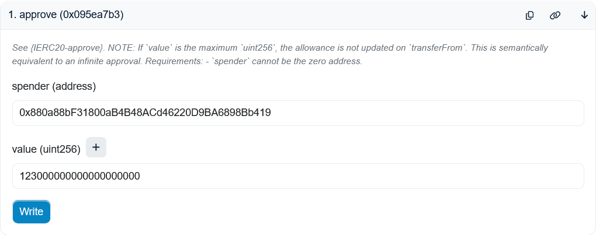
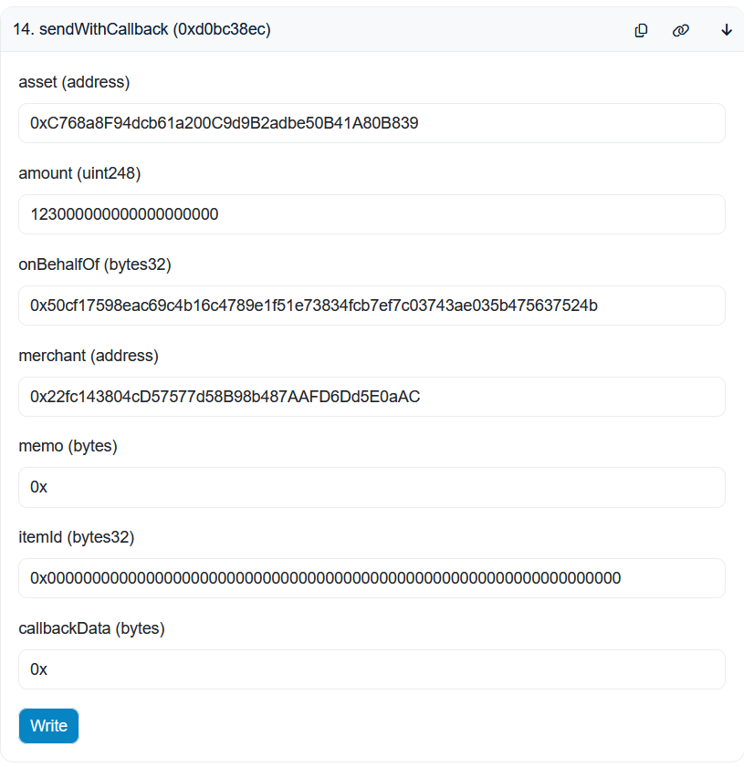

# How To Fund an Account with Dreamspace Pay

In order to use the Space and Time chain, compute credits are required. This how-to walks through the steps to fund an account with compute credits using the Dreamspace Pay smart contract (`0x880a88bF31800aB4B48ACd46220D9BA6898Bb419`). Alternatively, see ["How to Fund an Account Directly"](./HOW_TO_FUND_AN_ACCOUNT_DIRECTLY.md).

Dreamspace Pay supports funding with many different tokens. In this example, we will use `USDC` (`0xdAC17F958D2ee523a2206206994597C13D831ec7`).

Dreamspace Pay also supports the following tokens as well:

- `WETH` (`0xC02aaA39b223FE8D0A0e5C4F27eAD9083C756Cc2`), which has 18 decimals.
- `SXT` (`0xE6Bfd33F52d82Ccb5b37E16D3dD81f9FFDAbB195`), which has 18 decimals.
- `USDC` (`0xA0b86991c6218b36c1d19D4a2e9Eb0cE3606eB48`), which has 6 decimals.
- `USDT` (`0xdAC17F958D2ee523a2206206994597C13D831ec7`), which has 6 decimals.

## Step 1: Approve Spend

Call the [`approve`](https://etherscan.io/address/0xA0b86991c6218b36c1d19D4a2e9Eb0cE3606eB48#writeProxyContract#F1) function on the `USDC` contract.

- `spender` should be the DSPay contract address: `0x880a88bF31800aB4B48ACd46220D9BA6898Bb419`
- `value` should the the amount to be spent. Because USDC has 6 decimals, 123 USDC should be entered as `123000000`.

## Step 2: Send Funds

Call the [`sendWithCallback`](https://etherscan.io/address/0x880a88bF31800aB4B48ACd46220D9BA6898Bb419#writeContract#F14) function on the DSPay contract. (Do NOT use `send`.)

- `asset` should be the USDC token: `0xA0b86991c6218b36c1d19D4a2e9Eb0cE3606eB48`.
- `amount` should be the amount to be spent. This is the same as the `value` in the approve.
- `onBehalfOf` should be the 32 byte hex address to be funded. Be sure to use the 32 byte format of your address. See the ["How To convert between address formats"](./HOW_TO_CONVERT_BETWEEN_ADDRESS_FORMATS.md) for more details
- `merchant` should be the SXT Chain merchant address, which is `0xff0C0BeC16A1A7b1A1fF031a8a59b322159094C9`.
- `memo` can be anything. `0x` is fine.
- `itemId` should be `0x0000000000000000000000000000000000000000000000000000000000000000` (32 bytes of 0s)
- `callbackData` is ignored. `0x` is fine.

