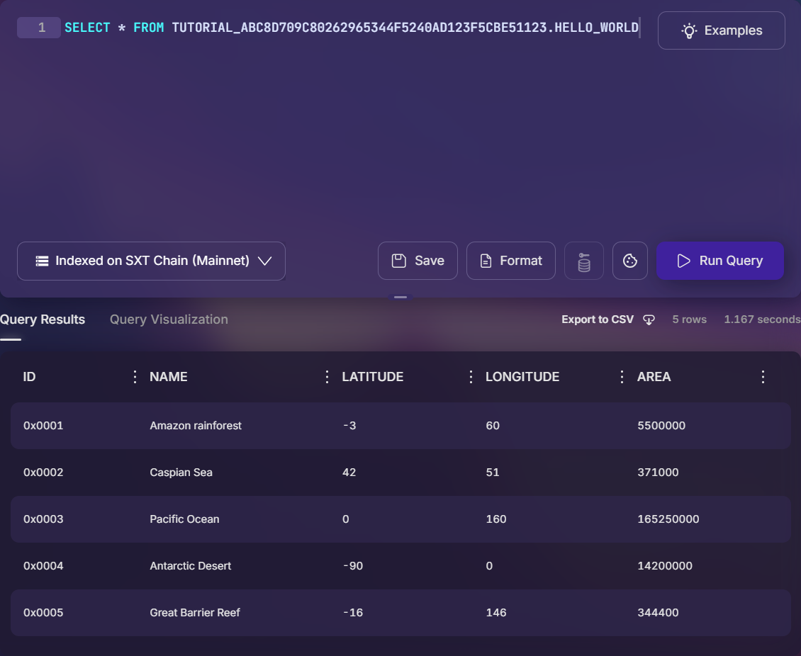

# Hello World Tutorial (Creating a Table)

In this tutorial, we will be creating a table on the SXT Chain using an ECDSA wallet.
The major steps we will walk through are

1. Funding a wallet with compute credits.
2. Cloning this repo.
3. Creating a table on the SXT Chain.
4. Inserting data into the new table.
5. Running a query with the [Dreamspace Data Studio](https://dreamspace.xyz/queries/new).
6. Doing the ["Onchain Query Hello World Tutorial"](../onchain_hello_world_query/).

## Step 1: Funding a wallet

In order to interact with the SXT Chain, we need compute credits. In this tutorial, we use the wallet address `0xABC8d709C80262965344f5240Ad123f5cBE51123` and funded it with 123 SXT. See ["How to Fund an Account Directly"](../how_to/HOW_TO_FUND_AN_ACCOUNT_DIRECTLY.md) or ["How To Fund an Account with Dreamspace Pay"](../how_to/HOW_TO_FUND_AN_ACCOUNT_WITH_DSPAY.md) for instructions.

## Step 2: Clone this repo

We will be using this repo, which has the scripts that we will be using. So, we clone this repo:

```bash
git clone git@github.com:spaceandtimefdn/sxt-chain-examples.git
cd sxt-chain-examples
```

We will be using [Node.js](https://nodejs.org/en/download/current) which can be installed a variety of ways.

Then, we need to install the prerequisite npm packages:

```bash
npm install
```

Then, we can make the `hello_world_tutorial` directory our working directory.

```bash
cd hello_world_tutorial
```

## Step 3: Creating a table (DDL)

We will write a node script that will create a table for us. This script is named `hello_world_create_table.js`. The table that we will create is the following, which we will name `HELLO_WORLD`:

| `ID` (`BINARY`) | `NAME` (`VARCHAR`) | `LATITUDE` (`BIGINT`) | `LONGITUDE` (`BIGINT`) | `AREA` (`BIGINT`) |
| --------------- | ------------------ | --------------------- | ---------------------- | ----------------- |
| 1               | Amazon rainforest  | -3                    | 60                     | 5500000           |
| 2               | Caspian Sea        | 42                    | 51                     | 371000            |
| 3               | Pacific Ocean      | 0                     | 160                    | 165250000         |
| 4               | Antarctic Desert   | -90                   | 0                      | 14200000          |
| 5               | Great Barrier Reef | -16                   | 146                    | 344400            |

The first thing we must do in order to create a table is create a connection with a Space and Time RPC node:

```javascript
const provider = new WsProvider("wss://rpc.testnet.sxt.network");
const api = await ApiPromise.create({ provider, noInitWarn: true });
```

Next, we build a transaction to create a new namespace. The namespace must end with the wallet address. We will use the namespace `TUTORIAL_ABC8D709C80262965344F5240AD123F5CBE51123`.

```javascript
const createNamespaceTX = api.tx.tables.createNamespace(
  "TUTORIAL_ABC8D709C80262965344F5240AD123F5CBE51123",
  0,
  "CREATE SCHEMA IF NOT EXISTS TUTORIAL_ABC8D709C80262965344F5240AD123F5CBE51123",
  "Community",
  { UserCreated: "Tutorial" },
);
```

Then, we build a transaction for the DDL of the new table.

```javascript
const createTablesTX = api.tx.tables.createTables([
  {
    ident: {
      namespace: "TUTORIAL_ABC8D709C80262965344F5240AD123F5CBE51123",
      name: "HELLO_WORLD",
    },
    createStatement:
      "CREATE TABLE TUTORIAL_ABC8D709C80262965344F5240AD123F5CBE51123.HELLO_WORLD (ID BINARY NOT NULL, NAME VARCHAR NOT NULL, LATITUDE BIGINT NOT NULL, LONGITUDE BIGINT NOT NULL, AREA BIGINT NOT NULL)",
    tableType: "Community",
    commitment: { Empty: { hyperKzg: true } },
    source: { UserCreated: "Planet Earth" },
  },
]);
```

Then, instead of submitting two separate transactions, we opt to batch these into a single transaction

```javascript
const batchTX = api.tx.utility.batchAll([createNamespaceTX, createTablesTX]);
```

We must sign the transaction. To do this, we add the private key of our `0xABC...123` wallet as an environment variable. We add it to a `.env` file and `import 'dotenv/config';`. The `.env` file looks like this:

```
PRIVATE_KEY=d157███████████████████████ REDACTED ███████████████████████f415
```

We can then create a wallet in our script by using the `ethers` package.

```javascript
const wallet = new Wallet(process.env.PRIVATE_KEY);
```

Finally, we submit the transaction to the SXT Chain to create the transaction.

```javascript
const signer = new EthEcdsaSigner(wallet, api);
await batchTX.signAndSend(signer.address, { signer });
```

Now, we run the script with

```bash
node hello_world_create_table.js
```

## Step 4: Inserting Data (DML)

Now that we have created the table, we need to insert data. The corresponding script is named `hello_world_insert_data.js`.
The majority of the script is identical to the one that created the table. The only different is how we build the transaction.

The data is inserted to the chain as an Apache Arrow table. We build the table as follows:

```javascript
const table = new Table({
  ID: vectorFromArray(
    ["0x0001", "0x0002", "0x0003", "0x0004", "0x0005"].map((a) => hexToU8a(a)),
    new Binary(),
  ),
  NAME: vectorFromArray(
    [
      "Amazon rainforest",
      "Caspian Sea",
      "Pacific Ocean",
      "Antarctic Desert",
      "Great Barrier Reef",
    ],
    new Utf8(),
  ),
  LATITUDE: vectorFromArray([-3n, 42n, 0n, -90n, -16n], new Int64()),
  LONGITUDE: vectorFromArray([60n, 51n, 160n, 0n, 146n], new Int64()),
  AREA: vectorFromArray(
    [5500000n, 371000n, 165250000n, 14200000n, 344400n],
    new Int64(),
  ),
});
```

Finally, we build the transaction that will insert the table. We need to specify a unique `batchId` for each insertion.

```javascript
const batchId = 1;
const insertDataTx = api.tx.indexing.submitData(
  {
    namespace: "TUTORIAL_ABC8D709C80262965344F5240AD123F5CBE51123",
    name: "HELLO_WORLD",
  },
  batchId,
  u8aToHex(tableToIPC(table)),
);
```

We run the script with

```bash
node hello_world_insert_data.js
```

We have now created a table, and inserted data!

## Step 5: Running a query (DQL)

We can go to the [Dreamspace Data Studio](https://dreamspace.xyz/queries/new) to see the newly created table and run queries. We must select "Indexed on SXT Chain (Mainnet)" in order to query this table.



## Step 6: Running an onchain query (DQL)

See the ["Onchain Query Hello World Tutorial"](../onchain_hello_world_query/) for a tutorial.
