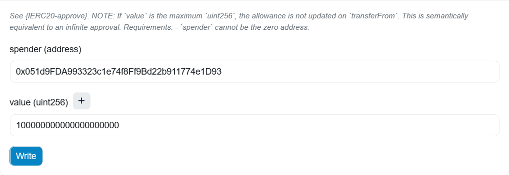
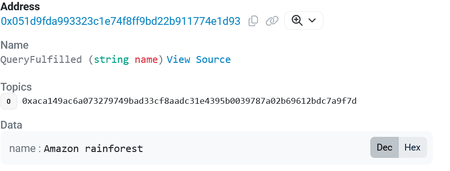

# Hello World Tutorial (Onchain Query with Proof of SQL)

In this tutorial, we will be running an onchain query against the table created in the ["Create Table Hello World Tutorial"](../create_hello_world_table/). This query uses Proof of SQL, a cryptographic protocol that gives smart contracts a guarantee of the correctness of the query result.

The major steps we will walk through are

1. Writing a smart contract
2. Deploying the smart contract
3. Running the query

## Step 1: Creating the contract

In order to run a SQL query, we first convert the SQL text to a hex query plan. We will run the simple query:

```sql
SELECT NAME FROM TUTORIAL_ABC8D709C80262965344F5240AD123F5CBE51123.HELLO_WORLD WHERE LONGITUDE = 60
```

In order to obtain the query plan, we send a request to an RPC node of the Space and Time network.

```bash
curl -X POST https://rpc.mainnet.sxt.network \
  -H "Content-Type: application/json" -d '{
    "jsonrpc": "2.0", "id": 1, "method": "commitments_v1_evmProofPlan",
    "params": {
      "query": "SELECT NAME FROM TUTORIAL_ABC8D709C80262965344F5240AD123F5CBE51123.HELLO_WORLD WHERE LONGITUDE = 60"
    }
  }'
```

The output is

```json
{
  "jsonrpc": "2.0",
  "id": 1,
  "result": {
    "proofPlan": "0x0000000000000001000000000000003d5455544f5249414c5f414243384437303943383032363239363533343446353234304144313233463543424535313132332e48454c4c4f5f574f524c440000000000000002000000000000000000000000000000044e414d4500000007000000000000000000000000000000094c4f4e47495455444500000005000000000000000100000000000000044e414d45000000000000000000000000000000020000000000000000000000010000000100000005000000000000003c0000000000000001000000000000000000000000",
    "at": "0x87a94aa75b8915f8e973f211ff1831bb608f3c1c99ff36282c47679c81d3dab5"
  }
}
```

We then create a constant in our smart contract with this query plan. (That is, using the `proofPlan` and dropping the `0x`.)

```solidity
// SELECT NAME FROM TUTORIAL_ABC8D709C80262965344F5240AD123F5CBE51123.HELLO_WORLD WHERE LONGITUDE = 60
bytes public constant QUERY_PLAN =
    hex"0000000000000001000000000000003d5455544f5249414c5f414243384437303943383032363239363533343446353234304144313233463543424535313132332e48454c4c4f5f574f524c440000000000000002000000000000000000000000000000044e414d4500000007000000000000000000000000000000094c4f4e47495455444500000005000000000000000100000000000000044e414d45000000000000000000000000000000020000000000000000000000010000000100000005000000000000003c0000000000000001000000000000000000000000";
```

We also import the `ProofOfSQL` library, which has all the necessary components to run this query. In particular, we will be using the `QueryRouter` contract to run the query.

```solidity
import "../libraries/ProofOfSQL.sol";
```

When the `query` method is called on the smart contract, we build the query:

```solidity
IQueryRouter.Query memory query = IQueryRouter.Query({
    innerQuery: QUERY_PLAN,
    parameters: ParamsBuilder.serializeParamArray(new bytes[](0)),
    version: VERSION,
    metadata: ""
});
```

We then need to specify a callback method to be called when the query has executed. We specify the contract, method, along with limits on gas usage:

```solidity
IQueryRouter.Callback memory callback = IQueryRouter.Callback({
    callbackContract: address(this),
    selector: HelloWorld.queryCallback.selector,
    gasLimit: 100_000,
    maxGasPrice: 10 gwei,
    callbackData: ""
});
```

Finally, we set query payment details:

```solidity
uint256 paymentAmount = 100 ether;
IQueryRouter.Payment memory payment = IQueryRouter.Payment({
    paymentAmount: paymentAmount, refundTo: msg.sender, timeout: uint64(block.timestamp + 1 hours)
});
IERC20(SXT).safeTransferFrom(msg.sender, address(this), paymentAmount);
IERC20(SXT).safeIncreaseAllowance(QUERY_ROUTER, paymentAmount);
```

Now, we start the query by calling `requestQuery`:

```solidity
bytes32 queryId = IQueryRouter(QUERY_ROUTER).requestQuery(query, callback, payment);
```

Once the query is fulfilled, the `queryCallback` function will be called by the query router.

Inside this function we need to ensure that no one malicious can trigger it:

```solidity
if (msg.sender != QUERY_ROUTER_EXECUTOR || !pendingQueries[queryId]) revert UnauthorizedCaller();
```

Then, we can use the result of the query inside our contract knowing that the result has been cryptographically verified using the Proof Of SQL protocol.

```solidity
(, ProofOfSqlTable.Table memory tableResult) = ProofOfSqlTable.__deserializeFromBytes(queryResult);
string[] memory names = ProofOfSqlTable.readVarCharColumn(tableResult, 0);
for (uint256 i = 0; i < names.length; ++i) {
    emit QueryFulfilled(names[i]);
}
```

## Step 2: Deploying the contract

To deploy the smart contract, we will be using standard [Foundry](https://getfoundry.sh/) tooling. The contract described above can be found in `contracts/src/HelloWorld/HelloWorld.sol`. First we clone this repo and switch into the `contracts` directory.

```bash
git clone git@github.com:spaceandtimefdn/sxt-chain-examples.git
cd sxt-chain-examples/contracts
```

Now, we deploy the smart contract with `forge`. (This can be first run without `--broadcast` to do a dry run.)

```
forge create HelloWorld --private-key $PRIVATE_KEY --rpc-url $RPC_URL --broadcast --verify
```

Our deployed contract has address `0x051d9FDA993323c1e74f8Ff9Bd22b911774e1D93` and can be found [here](https://etherscan.io/address/0x051d9FDA993323c1e74f8Ff9Bd22b911774e1D93).

## Step 3: Running the query

Now, to run the query, we must approve spend of 100 SXT for the contract. To do this, we call [`approve`](https://etherscan.io/token/0xe6bfd33f52d82ccb5b37e16d3dd81f9ffdabb195?a=0xabc8d709c80262965344f5240ad123f5cbe51123#writeContract#F1) on the SXT token contract. Because SXT has 18 decimals, we enter `100000000000000000000`, which is `100e18`.



Now, we can run the query by calling the [`query`](https://etherscan.io/address/0x051d9FDA993323c1e74f8Ff9Bd22b911774e1D93#writeContract#F1) method on the new `HelloWorld` contract


This triggers the query. When the callback is called, the event is emmited, and can be seen [here](https://etherscan.io/tx/0xcfd153a80a239a739c2cec3d8d5a0118e9051c8b3eb4655435b7cda997e3d196#eventlog#944).


